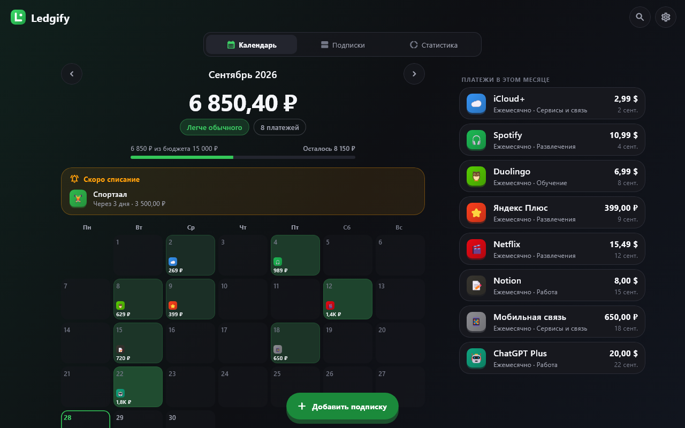
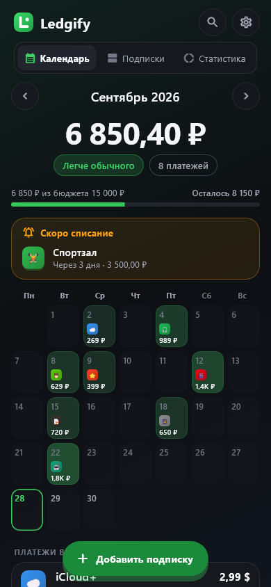
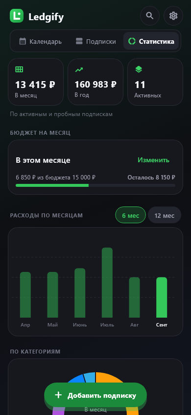
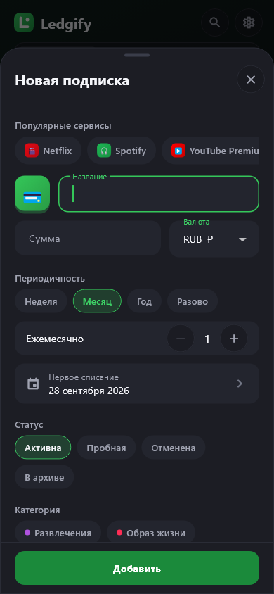

<p align="center"></p>

<h1 align="center">Ledgify</h1>

<p align="center">Спокойный трекер подписок и регулярных платежей для Windows и Android.<br>
<i>A calm subscription tracker for Windows and Android.</i></p>

<p align="center">
<br>



</p>

## Что умеет

- **Календарь месяца**: итог в одной валюте, иконки сервисов на днях списаний, платежи месяца, оценка «тяжелее или легче обычного».
- **Все подписки**: поиск, фильтр по статусу, сортировка по ближайшему списанию, стоимости, названию или категории.
- **Статистика**: сколько уходит в месяц и в год, бюджет, расходы за 6 или 12 месяцев, категории, самые дорогие сервисы.
- **Гибкая периодичность**: неделя, месяц, год, разово, «каждые N»; пробный период; отмена с датой; архив.
- **Мультивалютность**: у каждой подписки своя валюта, итоги в основной; курсы можно поправить или загрузить из сети.
- **Напоминания** «за N дней» прямо в календаре.
- **Резервная копия** в JSON и восстановление из неё.
- Тёмная и светлая тема, русский и английский, горячие клавиши на Windows.

Данные хранятся только на устройстве: без аккаунтов, рекламы и аналитики. В интернет приложение
обращается только по кнопке «Обновить курсы».

## Установка

Готовые сборки — в [Releases](https://github.com/alexskvo10/Ledgify/releases):

- **Windows**: распакуйте архив и запустите `ledgify.exe`.
- **Android**: установите `app-release.apk` (разрешите установку из этого источника).

## Сборка из исходников

Нужны [Flutter](https://docs.flutter.dev/get-started/install) 3.41+ (Dart 3.11+), для Windows —
Visual Studio с «Desktop development with C++», для Android — Android SDK.

```bash
flutter pub get
flutter analyze
flutter test
flutter build windows --release   # build/windows/x64/runner/Release/
flutter build apk --release       # build/app/outputs/flutter-apk/app-release.apk
```

Скриншоты всех экранов (обе темы × RU/EN × телефон и десктоп) в `build/screens/`:

```bash
LEDGIFY_SCREENSHOTS=1 flutter test test/screens_test.dart
```

Иконки приложения генерируются скриптом `python tool/make_icons.py` (нужен Pillow).

## Горячие клавиши (Windows)

| Клавиши | Действие |
|---|---|
| Ctrl + N | добавить подписку |
| Ctrl + F | поиск |
| Ctrl + 1 / 2 / 3 | календарь / подписки / статистика |
| ← / → | предыдущий / следующий месяц |
| Esc | закрыть окно или шторку |

## Документация

- [Идея, аудит и план](docs/PLAN.md)
- [Архитектура](docs/ARCHITECTURE.md): слои, модель, хранилище, формат резервной копии, тесты
- [Дизайн-система](docs/DESIGN_SYSTEM.md): цвета, типографика, токены, компоненты, UX-принципы
- [Проверка качества](docs/QA.md): что и как проверялось перед выпуском
- [Бэклог](docs/BACKLOG.md)
- [История изменений](CHANGELOG.md)

## Стек

Flutter · Hive · provider · fl_chart · intl

## Лицензия

[MIT](LICENSE)
